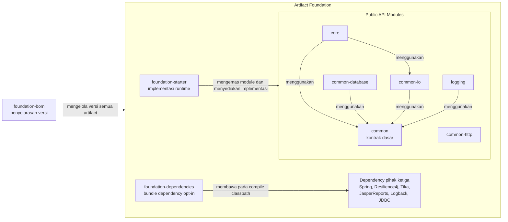

# Reyga Starter Foundation

Reyga Starter Foundation adalah library Java multi-module untuk membangun backend
service berbasis Spring Boot dengan kontrak, pola implementasi, dan konfigurasi
yang konsisten. API publik dipisahkan dari implementasi default agar aplikasi
dapat memilih module yang diperlukan dan mengganti implementasi tanpa mengubah
kontrak utama.

Kemampuan utama library:

- menyediakan base service dan controller dengan lifecycle request yang konsisten;
- menstandardisasi success response, error response, application fault, validation
  fault, dan file error;
- menyediakan Jakarta Bean Validation programmatic serta annotation
  `@FieldPresence`, `@FieldFormat`, `@FieldLength`, dan `@FieldNumberRange`;
- menyediakan repository JDBC, SQL builder, typed query operator, pagination, dan
  result-set mapping;
- menyediakan inspeksi file, sanitasi HTML, pemeriksaan indikasi XSS/SQL injection,
  metadata I/O, dan pembuatan report JasperReports;
- menyediakan structured logging, HTTP request/response logging, MDC propagation,
  rolling log, dan summary log;
- menyediakan facade untuk rate limiter, circuit breaker, retry, serta eksekusi
  transactional dengan fallback;
- menyediakan Spring Boot auto-configuration dan implementasi default melalui
  artifact runtime `foundation-starter`;
- menyediakan `foundation-bom` untuk menyelaraskan versi seluruh artifact
  foundation dari satu deklarasi versi;
- menyediakan `foundation-dependencies` sebagai bundle opt-in seluruh dependency
  produksi pihak ketiga pada compile classpath consumer;
- mendukung publikasi seluruh artifact ke Maven Local atau Nexus Repository.

Library ini ditujukan sebagai foundation internal untuk beberapa service yang
memerlukan standard response, validation, persistence, logging, dan operational
behavior yang sama. Setiap fitur opt-in tetap dikontrol dari konfigurasi aplikasi
consumer.

Repository: https://github.com/ReygaFitra/reyga-starter-foundation

## Tech Stack

- **Language dan build**
  - Java `25` dengan Gradle Java Toolchain.
  - Gradle Kotlin DSL multi-module, minimum Gradle `9.1.0`.
  - Gradle Wrapper project menggunakan Gradle `9.7.1`.
  - Plugin `java-library`, `java-platform`, `maven-publish`, dan Spring Dependency
    Management `1.1.5`.
- **Spring ecosystem**
  - Spring Boot `4.0.0` untuk starter, auto-configuration, web, validation, JPA,
    dan AspectJ integration.
  - Spring Framework `7.0.1` untuk Spring Web dan Spring JDBC.
  - Spring Data Commons `4.0.0` untuk kontrak pagination.
  - Spring JDBC dan `JdbcTemplate` untuk akses database.
- **Jakarta API dan mapping**
  - Jakarta Persistence API `3.1.0`.
  - Jakarta Validation API `3.1.1`.
  - MapStruct `1.6.3` dan Lombok `1.18.38`.
- **Resilience**
  - Resilience4j `2.3.0` untuk rate limiter, circuit breaker, dan retry.
  - Spring Cache abstraction untuk integrasi cache pada rate limiter.
- **File, security, dan report**
  - Apache Tika `3.3.0` untuk deteksi media type dan ekstraksi content.
  - OWASP Java HTML Sanitizer `20240325.1` untuk sanitasi HTML.
  - JasperReports `7.0.6` untuk compile, fill, dan export report.
- **Database dan logging**
  - Oracle JDBC `23.7.0.25.01` sebagai driver database yang tersedia pada module
    database.
  - Logback Classic `1.5.38` untuk console, rolling file, dan summary logging.
- **Testing**
  - JUnit Jupiter `5.12.2`.
  - Mockito `5.14.2`.
- **Distribusi**
  - Maven publication dengan sources JAR, Javadoc JAR, Maven Local, dan Nexus
    release/snapshot repository.
  - Maven BOM berbentuk POM untuk menyelaraskan versi artifact pada consumer
    Gradle maupun Maven.

## Struktur Module

### `common`

Module kontrak dasar yang digunakan bersama oleh seluruh foundation.

- **Response dan request model**
  - Menyediakan `BaseRequest`, `EmptyRequest`, `BaseResponse`, `ResponseData`,
    `ResponseError`, `EmptyResponse`, dan `ResponseStatusOnly`.
  - Menyediakan `FieldErrorDetail`, `FileErrorDetail`, dan `ResponseErrorDetail`
    untuk diagnostic response yang terstruktur.
- **Standard enum**
  - Menyediakan `ServiceCodeEnum`, `ServiceStatusResponseEnum`,
    `StarterHeaderEnum`, dan `FieldFormatTypeEnum`.
- **Logging contract**
  - Menyediakan `CommonLogger`, `CommonLoggerFactory`, `@InjectLogger`, dan
    `LoggerInjector`.
  - Menyediakan `HttpBuilder` dan `HttpHeaderBuilder` untuk membentuk context log
    HTTP secara konsisten.
- **Mapping contract**
  - Menyediakan `BaseMapper` dan `CommonMapperConfig` untuk mapper MapStruct yang
    terintegrasi dengan Spring.
- **Utility umum**
  - Menyediakan `DateUtility`, `FileUtility`, dan `MapperUtility`.
- **Dependency utama**
  - Spring Boot Web, MapStruct, Jakarta Persistence, dan Lombok.
- **Artifact Maven**
  - `com.reyga-dev.starter:common:<version>`.

### `common-database`

Module kontrak persistence berbasis Spring JDBC dan SQL builder.

- **Repository contract**
  - Menyediakan `BaseJdbcRepository` sebagai kontrak reusable untuk repository
    aplikasi.
  - Menyediakan `QueryProcessor` untuk query, update, batch, single-result, dan
    pagination.
- **Dynamic query**
  - Menyediakan `QueryBuilder` untuk SELECT, INSERT, UPDATE, DELETE, join,
    grouping, sorting, parameter binding, dan pagination.
  - Menyediakan `QueryFunction`, `QueryOperator`, `QueryJoinType`, dan `QueryType`
    agar query tidak bergantung pada string operator bebas.
- **Result mapping**
  - Menyediakan `JdbcResultSetMapper`, `@MapperColumn`, dan
    `MapperColumnProcessor` untuk mapping row database ke object.
- **Pagination**
  - Menggunakan `Page`, `Pageable`, dan `PageImpl` dari Spring Data Commons.
- **Dependency internal**
  - Bergantung pada module `common`; implementasi `DefaultQueryProcessor`
    disediakan oleh runtime starter.
- **Artifact Maven**
  - `com.reyga-dev.starter:common-database:<version>`.

- **Panduan terkait**
  - [Repository Implementation Guide](docs/REPOSITORY_IMPLEMENTATION_GUIDE.md).

### `common-io`

Module kontrak untuk inspeksi, sanitasi, diagnostic I/O, dan report generation.

- **File inspection**
  - Menyediakan `FileInspector` untuk deteksi media type, ekstraksi content,
    streaming `Reader`, dan translation melalui Apache Tika.
- **File sanitization**
  - Menyediakan `FileSanitizer` untuk sanitasi HTML, pemeriksaan perubahan oleh
    policy XSS, dan pemeriksaan pola SQL injection.
  - Menyediakan `SqlInjectionPatterns` sebagai kumpulan pola bawaan.
- **I/O error contract**
  - Menyediakan `IOFaultException` dan `IOFaultMetadata` dengan informasi operasi,
    permission, storage type, MIME type, charset, ukuran, checksum, dan offset.
  - Menyediakan enum `IOOperation`, `IOPermissions`, dan `IOStorageType`.
- **Report generation**
  - Menyediakan staged API `ReportBuilder`, provider SPI, dan `ReportType` untuk
    compile JRXML, fill data, dan export beberapa format JasperReports.
- **Dependency internal**
  - Bergantung pada module `common`; implementasi inspector, sanitizer, dan report
    provider disediakan oleh runtime starter.
- **Artifact Maven**
  - `com.reyga-dev.starter:common-io:<version>`.
- **Panduan terkait**
  - [Utilities Guide](docs/UTILITIES_GUIDE.md).

### `common-http`

Module kontrak HTTP client berbasis OkHttp untuk call sinkron, asinkron, dan
response caching.

- **HTTP client contract**
  - Menyediakan `StarterHttpClient` dengan tipe request, response, callback, dan
    cache dari OkHttp.
  - Call asinkron mengembalikan handle `Call` untuk inspeksi atau pembatalan.
  - Response dari call sinkron dan callback asinkron wajib ditutup oleh consumer.
- **Implementasi runtime**
  - `DefaultStarterHttpClient` menggunakan satu `OkHttpClient` reusable agar
    connection pool dan dispatcher dapat dipakai lintas request.
  - Bean default bersifat opt-in melalui
    `reyga.config.default-bean.http-client=true`; bean `OkHttpClient` atau
    `StarterHttpClient` milik consumer mengambil prioritas.
- **Artifact Maven**
  - `com.reyga-dev.starter:common-http:<version>`.

### `core`

Module kontrak aplikasi untuk service flow, controller, validation, resilience,
event, aspect, transaction, dan exception model.

- **Service abstraction**
  - Menyediakan `BaseService` dan `FoundationService` dengan lifecycle validasi,
    proses bisnis, dan HTTP servlet context yang konsisten.
  - Menyediakan `AsyncPipelineExecutor` dan `TransactionalPipelineExecutor`.
- **Controller dan response**
  - Menyediakan `BaseController`, `ResilienceBaseController`,
    `BaseHttpServletBuilder`, `ResponseBuilder`, dan `ResponseErrorBuilder`.
- **Validation**
  - Menyediakan annotation `@FieldPresence`, `@FieldFormat`, `@FieldLength`, dan
    `@FieldNumberRange` beserta constraint processor.
  - Menyediakan `ValidationUtility`, immutable `ValidationConfig`,
    `ValidationUtilityProvider`, dan `BaseValidationProcessor`.
- **Exception contract**
  - Menyediakan `AppFaultContent`, `AppFaultException`,
    `ValidationFaultException`, dan `BaseExceptionHandler`.
- **Resilience dan transaction**
  - Menyediakan `ResilienceService`, `TransactionalExecutor`, dan
    `BaseTransactionalExecutor`.
- **Aspect dan event**
  - Menyediakan advice Around, Before, After, After Returning, dan After
    Throwing melalui anotasi `@AroundExecution`, `@BeforeExecution`,
    `@AfterExecution`, `@AfterReturningExecution`, dan
    `@AfterThrowingExecution`.
  - Setiap advice mempunyai base behavior dan konfigurasi pemilihan bean sendiri,
    dengan validasi konfigurasi saat startup.
  - Menyediakan `GenericEvent` dan `BaseGenericEventListener` untuk event
    aplikasi.
- **Dependency internal**
  - Bergantung pada module `common` dan `common-io`; implementasi default service,
    handler, validator, dan transaction executor disediakan runtime starter.
- **Artifact Maven**
  - `com.reyga-dev.starter:core:<version>`.
- **Panduan terkait**
  - [Service Implementation Guide](docs/SERVICE_IMPLEMENTATION_GUIDE.md).
  - [Controller Implementation Guide](docs/CONTROLLER_IMPLEMENTATION_GUIDE.md).
  - [Utilities Guide](docs/UTILITIES_GUIDE.md#k-aspect-advice).

### `logging`

Module kontrak dan konfigurasi output logging berbasis Logback.

- **Logging service contract**
  - Menyediakan `LoggingService` untuk lifecycle request, response, dan summary
    logging.
- **Log filters**
  - Menyediakan base filter dan implementasi default untuk console, rolling file,
    serta summary log.
- **External properties**
  - Menyediakan `LoggingProperties` dan `AsyncLoggingProperties` untuk binding
    konfigurasi console, file, archive, summary, dan executor.
- **Logback integration**
  - Menyediakan `META-INF/logback-spring.xml` dan logging-system metadata langsung
    di artifact `logging`.
  - Mendukung active log, size-and-time based rollover, retention, serta filter
    summary berbasis MDC.
- **Dependency internal**
  - Bergantung pada module `common`; HTTP advice, MDC-aware executor, dan default
    logging service disediakan runtime starter.
- **Artifact Maven**
  - `com.reyga-dev.starter:logging:<version>`.

### `foundation-starter-internal`

Module source private yang mengemas seluruh implementasi default dan Spring Boot
auto-configuration. Module ini dipublish dengan nama artifact publik
`foundation-starter`.

- **Auto-configuration**
  - Menyediakan `FoundationDefaultAutoConfiguration`, `CoreConfig`,
    `ValidationAutoConfiguration`, `CommonConfig`, `CommonDatabaseConfig`,
    `CommonIOConfig`, `CommonHttpAutoConfiguration`, `LoggingConfig`, dan
    `AsyncLoggingConfig`.
- **Default implementations**
  - Menyediakan `DefaultQueryProcessor`, `DefaultFileInspector`,
    `DefaultFileSanitizer`, `DefaultReportBuilder`, `DefaultValidationUtility`,
    `DefaultTransactionalExecutor`, `DefaultResilienceService`,
    `DefaultStarterHttpClient`, dan `DefaultLoggingService`.
- **Exception handling**
  - Menyediakan default handler untuk application fault, validation fault,
    database error, I/O error, dan exception umum.
- **HTTP logging runtime**
  - Menyediakan request/response body advice dan executor asynchronous yang
    meneruskan MDC.
- **Provider discovery**
  - Mendaftarkan provider report dan validation melalui Java `ServiceLoader`.
- **Dependency internal**
  - Mendistribusikan `common`, `common-database`, `common-io`, `common-http`,
    `core`, dan `logging` sebagai dependency metadata.
- **Artifact Maven**
  - `com.reyga-dev.starter:foundation-starter:<version>`.
  - Digunakan sebagai `runtimeOnly` pada Gradle atau scope `runtime` pada Maven.

### `foundation-bom`

Module platform yang memusatkan versi artifact Reyga Starter Foundation. BOM
tidak membawa class, implementasi, atau auto-configuration; consumer tetap
memilih module yang diperlukan, sedangkan versinya diperoleh dari BOM.

- **Version alignment**
  - Mengelola versi `common`, `common-database`, `common-io`, `common-http`,
    `core`, `logging`, `foundation-starter`, dan `foundation-dependencies`.
  - Mencegah consumer mencampur versi module foundation yang belum tentu
    kompatibel, misalnya `common:1.1.0` dengan `core:2.0.0`.
- **Gradle platform**
  - Dibangun menggunakan plugin `java-platform` dan dipakai melalui
    `platform("com.reyga-dev.starter:foundation-bom:<version>")`.
- **Maven BOM**
  - Dipublikasikan sebagai POM dengan bagian `dependencyManagement` dan diimpor
    menggunakan scope `import`.
- **Batas tanggung jawab**
  - Tidak otomatis menambahkan semua module ke aplikasi.
  - Tidak menggantikan `foundation-starter`; BOM mengatur versi, sedangkan
    starter menyediakan implementasi runtime dan auto-configuration.
  - Tidak menghasilkan binary JAR, sources JAR, atau Javadoc JAR.
- **Artifact Maven**
  - `com.reyga-dev.starter:foundation-bom:<version>`.

### `foundation-dependencies`

Module aggregator opt-in yang membawa seluruh dependency produksi pihak ketiga
yang digunakan Reyga Starter Foundation. Module ini menghasilkan JAR kosong;
fungsi utamanya berada pada metadata dependency di POM dan Gradle Module Metadata.

- **Dependency yang disediakan**
  - Spring Boot Web, Validation, Data JPA, dan AspectJ starter.
  - Spring Web, Spring JDBC, serta Spring Data Commons.
  - Jakarta Persistence, Jakarta Validation, MapStruct, Resilience4j, dan
    Logback Classic.
  - Apache Tika, OWASP Java HTML Sanitizer, JasperReports beserta exporter,
    OkHttp, dan Oracle JDBC.
- **Cara kerja**
  - Seluruh dependency dideklarasikan sebagai Gradle `api` dan dipublikasikan
    sebagai Maven scope `compile`.
  - Consumer yang menambahkan artifact ini memperoleh seluruh dependency pada
    compile dan runtime classpath secara transitif.
- **Batas tanggung jawab**
  - Tidak membawa class API atau implementasi Reyga Starter Foundation.
  - Tidak membawa dependency test, Lombok, atau annotation processor seperti
    MapStruct Processor.
  - Cocok untuk aplikasi yang memang memakai sebagian besar fitur foundation;
    aplikasi yang ingin classpath lebih kecil dapat tetap memakai dependency
    transitif dari module API masing-masing.
- **Artifact Maven**
  - `com.reyga-dev.starter:foundation-dependencies:<version>`.

## Panduan Konfigurasi

- [Panduan Utilities](docs/UTILITIES_GUIDE.md) - penggunaan validation,
  resilience, transaction, Aspect Advice, file, report, mapping, HTTP client,
  dan utility umum.

- [Foundation Configuration Guide](docs/CONFIGURATION_GUIDE.md) - feature flag,
  default bean, validation, exception handler, logging, async executor,
  resilience, contoh YAML, dan troubleshooting.

Dokumentasi di folder `docs/` selalu menjelaskan API, konfigurasi, dan perilaku
pada source project saat ini. Setiap perubahan kontrak atau runtime behavior harus
memperbarui panduan terkait dalam development yang sama. Versi artifact tetap
dikontrol terpusat melalui `projectVersion` di `gradle.properties`.

## Dependency Antar Module

- `common` menjadi kontrak dasar tanpa dependency ke module foundation lain.
- `common-database` bergantung pada `common`.
- `common-io` bergantung pada `common`.
- `common-http` mengekspos kontrak OkHttp dan tidak bergantung pada module
  foundation lainnya.
- `core` bergantung pada `common` dan `common-io`.
- `logging` bergantung pada `common`.
- `foundation-starter-internal` bergantung pada seluruh module publik dan
  menghasilkan artifact runtime `foundation-starter`.
- `foundation-dependencies` mengagregasi seluruh dependency produksi pihak
  ketiga sebagai dependency transitif compile dan tidak bergantung pada module
  source foundation.
- `foundation-bom` tidak menjadi dependency runtime. Module ini hanya mengelola
  versi seluruh artifact publik foundation, termasuk `foundation-starter` dan
  `foundation-dependencies`.



Garis penuh menunjukkan dependency, bundle compile, atau distribusi implementasi
runtime. Garis putus-putus menunjukkan pengelolaan versi oleh BOM dan tidak
menambahkan module tersebut sebagai dependency aplikasi.

## Build & Publish

### Prasyarat Gradle

Project library ini wajib dibangun dan dipublish menggunakan Gradle versi
`9.1.0` atau lebih baru. Wrapper repository saat ini menggunakan Gradle `9.7.1`.
Gunakan Gradle Wrapper agar versi Gradle konsisten pada local development dan CI:

```bash
./gradlew --version
```

Pada Windows gunakan `gradlew.bat`. Jika wrapper pada checkout lama masih berada
di bawah versi minimum, perbarui dengan Gradle yang sudah terpasang:

```bash
gradle wrapper --gradle-version 9.7.1
```

Project juga menggunakan Java toolchain sesuai `javaVersion` pada
`gradle.properties`. Pastikan JDK yang sesuai tersedia sebelum menjalankan build
atau publishing.

### Artifact yang dipublish

Artifact Java berikut dikonfigurasi sebagai Java library dan Maven publication:

- `common`
- `common-database`
- `common-io`
- `common-http`
- `core`
- `logging`
- `foundation-dependencies`

Module source `foundation-starter-internal` menyediakan implementasi default dan
auto-configuration. Hasil build-nya dipublish sebagai artifact `foundation-starter`,
bukan sebagai artifact `foundation-starter-internal`. JAR ini membawa bytecode
implementasi dan resource auto-configuration; dependency API dan pihak ketiga
tetap didistribusikan melalui metadata dependency, bukan digabungkan ke dalam JAR.
Source dan Javadoc JAR juga diterbitkan sesuai konfigurasi module.

Module `foundation-bom` dikonfigurasi sebagai Java platform dan dipublikasikan
dengan artifact ID `foundation-bom`. Artifact ini menghasilkan POM serta Gradle
module metadata untuk mengelola versi dependency. Karena tidak memiliki source
code, BOM tidak menghasilkan binary JAR, sources JAR, atau Javadoc JAR.

Module `foundation-dependencies` dipublikasikan sebagai Java library aggregator.
Binary JAR-nya tidak memuat class aplikasi; POM dan Gradle Module Metadata-nya
mendeklarasikan seluruh dependency produksi pihak ketiga dengan scope compile.
Source dan Javadoc JAR kosong tetap diterbitkan agar bentuk publication konsisten
dengan artifact Java lainnya.

Koordinat artifact:
- `group`: `com.reyga-dev.starter`
- `version`: dikontrol terpusat via `gradle.properties` (`projectVersion`)

### Konfigurasi repository Nexus

Isi konfigurasi berikut pada `gradle.properties` sebelum melakukan publish:

```properties
projectGroup=com.reyga-dev.starter
projectVersion=1.1.0

nexusReleaseRepositoryUrl=https://nexus.example.com/repository/maven-releases/
nexusSnapshotRepositoryUrl=https://nexus.example.com/repository/maven-snapshots/
nexusUsername=your-nexus-username
nexusPassword=your-nexus-password
nexusAllowInsecureProtocol=false
```

Ganti URL dan credential dummy dengan konfigurasi Nexus environment tujuan.
Jangan commit credential asli. Untuk penggunaan lokal atau CI, property dengan
nama yang sama dapat disimpan pada `~/.gradle/gradle.properties` atau diberikan
melalui secret CI.

Pemilihan repository dilakukan otomatis berdasarkan `projectVersion`:

- versi berakhiran `-SNAPSHOT`, misalnya `1.0.1-SNAPSHOT`, dikirim ke
  `nexusSnapshotRepositoryUrl`;
- versi lain, misalnya `1.0.1`, dikirim ke
  `nexusReleaseRepositoryUrl`.

Gunakan HTTPS dan `nexusAllowInsecureProtocol=false` untuk Nexus production.
Jika Nexus development hanya tersedia melalui HTTP, URL dapat menggunakan
`http://` dengan opt-in berikut:

```properties
nexusAllowInsecureProtocol=true
```

### Publish ke Maven Local

Publish seluruh artifact ke repository Maven lokal untuk pengujian integrasi:

```bash
./gradlew clean publishToMavenLocal
```

Artifact akan tersedia di `~/.m2/repository/com/reyga-dev/starter/`. Untuk
publish satu module saja, gunakan path task module:

```bash
./gradlew :core:publishToMavenLocal
./gradlew :foundation-starter-internal:publishToMavenLocal
./gradlew :foundation-dependencies:publishToMavenLocal
./gradlew :foundation-bom:publishToMavenLocal
```

Walaupun nama source module terakhir adalah `foundation-starter-internal`,
artifact yang dihasilkan bernama `foundation-starter`.

### Publish ke Nexus

Pastikan build dan test berhasil sebelum mengunggah seluruh artifact:

```bash
./gradlew clean build
./gradlew publish
```

Task `publish` mengunggah publication dari seluruh module ke repository Nexus
yang dipilih berdasarkan versi. Untuk publish satu module:

```bash
./gradlew :common:publishAllPublicationsToNexusRepository
./gradlew :core:publishAllPublicationsToNexusRepository
./gradlew :foundation-starter-internal:publishAllPublicationsToNexusRepository
./gradlew :foundation-dependencies:publishAllPublicationsToNexusRepository
./gradlew :foundation-bom:publishAllPublicationsToNexusRepository
```

Untuk memeriksa rangkaian task tanpa mengunggah artifact:

```bash
./gradlew publish --dry-run
```

Setelah publish berhasil, verifikasi pada Nexus bahwa group
`com.reyga-dev.starter`, artifact name, version, dan POM tersedia. Untuk artifact
Java, periksa juga JAR, sources JAR, dan Javadoc JAR. Untuk `foundation-bom`,
periksa isi `dependencyManagement` pada POM karena artifact ini tidak memiliki
JAR.

Repository release umumnya tidak mengizinkan versi yang sama ditimpa. Naikkan
`projectVersion` untuk release berikutnya. Gunakan suffix `-SNAPSHOT` selama
development apabila repository snapshot mengizinkan pembaruan artifact.

### Troubleshooting publishing

- `Using insecure protocols ... unsupported`: gunakan HTTPS, atau set
  `nexusAllowInsecureProtocol=true` khusus Nexus HTTP yang dipercaya.
- HTTP `401`: periksa `nexusUsername` dan `nexusPassword`.
- HTTP `403`: pastikan user Nexus mempunyai permission upload pada hosted
  repository tujuan.
- HTTP `400` atau repository menolak version policy: pastikan release dikirim ke
  repository release dan versi `-SNAPSHOT` dikirim ke repository snapshot.
- Artifact sudah tersedia dan tidak dapat ditimpa: naikkan `projectVersion` atau
  gunakan versi snapshot sesuai kebijakan Nexus.

### Menggunakan library setelah dipublish

#### Dependency transitif yang disediakan

Artifact library mempublikasikan dependency yang diperlukan oleh API dan runtime.
Consumer tidak perlu mendeklarasikan ulang dependency seperti Spring AOP,
Jakarta Validation, Resilience4j, Tika, OWASP Sanitizer, JasperReports, Spring
JDBC, atau Logback selama dependency transitif tidak dikecualikan.

Dependency langsung yang tercantum pada POM setiap artifact adalah:

| Artifact | Scope compile/API | Scope runtime |
|---|---|---|
| `common` | Spring Boot Starter Web `4.0.0`, Jakarta Persistence API `3.1.0`, MapStruct `1.6.3` | - |
| `common-database` | `common`, Spring Data Commons `4.0.0`, Spring JDBC `7.0.1` | Oracle JDBC `23.7.0.25.01` |
| `common-io` | Spring Web `7.0.1`, Apache Tika `3.3.0`, OWASP Java HTML Sanitizer `20240325.1`, JasperReports `7.0.6` | - |
| `common-http` | OkHttp JVM `5.5.0` | - |
| `core` | `common`, Spring Boot Starter Validation `4.0.0`, Jakarta Validation API `3.1.1`, Resilience4j `2.3.0`, Spring Boot Starter Data JPA `4.0.0`, Spring Boot Starter AspectJ `4.0.0` | - |
| `logging` | Spring Boot Starter Web `4.0.0`, Logback Classic `1.5.38` | `common` |
| `foundation-starter` | Seluruh module publik foundation | Spring Boot Data JPA, Validation, AspectJ, Resilience4j, Tika, OWASP Sanitizer, serta JasperReports core dan exporter |
| `foundation-dependencies` | Seluruh dependency produksi pihak ketiga yang digunakan foundation | - |
| `foundation-bom` | Constraint versi seluruh artifact foundation | - |

Konfigurasi Gradle `api` dipakai ketika tipe dependency muncul pada public API
library. Konfigurasi `implementation` dipublikasikan sebagai dependency runtime.
Dependency build seperti Lombok, MapStruct processor, JUnit, Mockito, dan Jackson
untuk test tidak ikut dipublikasikan kepada consumer.

Untuk Aspect Advice, `spring-boot-starter-aspectj` berasal secara transitif dari
artifact `core`. Consumer cukup menambahkan `core` dan `foundation-starter`
sesuai contoh berikut tanpa menambahkan Spring AOP secara manual.

Aplikasi consumer harus menambahkan module kontrak yang digunakan pada compile
classpath dan `foundation-starter` pada runtime classpath. Gunakan
`foundation-bom` agar seluruh artifact memperoleh versi foundation yang sama.
Versi cukup ditulis pada deklarasi BOM; dependency module lainnya tidak perlu
menuliskan versi masing-masing.

| Artifact | Tambahkan ketika aplikasi membutuhkan |
|---|---|
| `common` | DTO, enum, kontrak logging, dan utility umum |
| `common-database` | `BaseJdbcRepository`, `QueryBuilder`, `QueryProcessor`, dan mapper JDBC |
| `common-io` | `FileInspector`, `FileSanitizer`, report builder, dan exception I/O |
| `common-http` | `StarterHttpClient` untuk HTTP call sinkron, asinkron, dan response caching |
| `core` | base service/controller, validation, exception handling, resilience, dan transaksi |
| `logging` | kontrak, filter, serta konfigurasi Logback foundation |
| `foundation-starter` | implementasi default dan Spring Boot auto-configuration pada runtime |
| `foundation-dependencies` | seluruh dependency produksi pihak ketiga pada compile classpath |
| `foundation-bom` | penyelarasan versi seluruh artifact foundation; tidak menyediakan class runtime |

Deklarasikan secara eksplisit setiap module API yang class-nya dipakai source
aplikasi. Jangan memakai nama source module `foundation-starter-internal` sebagai
artifact dependency; nama artifact publiknya adalah `foundation-starter`.

Sebagai contoh, jika BOM versi `1.1.0` digunakan, deklarasi `core` tanpa versi
akan di-resolve menjadi `core:1.1.0`. BOM tidak otomatis menambahkan `core` atau
module lainnya; BOM hanya menyediakan versinya ketika module tersebut dipilih.

Untuk memperoleh seluruh dependency pihak ketiga melalui satu deklarasi,
tambahkan `foundation-dependencies`. Artifact ini bersifat opt-in karena membawa
dependency untuk semua fitur, termasuk JasperReports exporter dan Oracle JDBC.
Consumer tetap menambahkan module foundation yang API-nya digunakan serta
`foundation-starter` untuk implementasi runtime.

#### Consumer Gradle dengan Maven Local

Setelah library dipublish menggunakan `publishToMavenLocal`, tambahkan
`mavenLocal()` sebelum repository remote pada project consumer.

Contoh `settings.gradle.kts`:

```kotlin
dependencyResolutionManagement {
    repositories {
        mavenLocal()
        mavenCentral()
    }
}
```

Jika project mengatur repository langsung pada `build.gradle.kts`:

```kotlin
repositories {
    mavenLocal()
    mavenCentral()
}
```

Tambahkan dependency sesuai kebutuhan aplikasi:

```kotlin
val foundationVersion = "1.1.0"

dependencies {
    implementation(platform(
        "com.reyga-dev.starter:foundation-bom:$foundationVersion"
    ))

    implementation("com.reyga-dev.starter:common")
    implementation("com.reyga-dev.starter:core")

    // Opsional: membawa seluruh dependency produksi pihak ketiga.
    implementation("com.reyga-dev.starter:foundation-dependencies")

    // Tambahkan hanya jika API module berikut dipakai langsung.
    implementation("com.reyga-dev.starter:common-database")
    implementation("com.reyga-dev.starter:common-io")
    implementation("com.reyga-dev.starter:common-http")
    implementation("com.reyga-dev.starter:logging")

    // Menyediakan implementasi dan auto-configuration pada runtime.
    runtimeOnly("com.reyga-dev.starter:foundation-starter")
}
```

Untuk Gradle Groovy DSL, konfigurasi setara menggunakan:

```groovy
repositories {
    mavenLocal()
    mavenCentral()
}

def foundationVersion = "1.1.0"

dependencies {
    implementation platform(
        "com.reyga-dev.starter:foundation-bom:${foundationVersion}"
    )

    implementation "com.reyga-dev.starter:common"
    implementation "com.reyga-dev.starter:core"
    implementation "com.reyga-dev.starter:foundation-dependencies"
    runtimeOnly "com.reyga-dev.starter:foundation-starter"
}
```

Gradle menyimpan cache dependency. Jika version yang sama dipublish ulang ke
Maven Local selama development, refresh dependency consumer dengan:

```bash
./gradlew clean build --refresh-dependencies
```

#### Consumer Gradle dengan Nexus

Gunakan satu Nexus group repository, misalnya `maven-public`, yang mencakup hosted
release, hosted snapshot, dan proxy Maven Central. Simpan konfigurasi consumer
pada `gradle.properties` milik project atau `~/.gradle/gradle.properties`:

```properties
foundationNexusRepositoryUrl=https://nexus.example.com/repository/maven-public/
foundationNexusUsername=your-nexus-username
foundationNexusPassword=your-nexus-password
foundationNexusAllowInsecureProtocol=false
```

Kemudian tambahkan repository pada `settings.gradle.kts` consumer:

```kotlin
dependencyResolutionManagement {
    repositories {
        maven {
            name = "reygaNexus"
            url = uri(providers.gradleProperty("foundationNexusRepositoryUrl").get())
            isAllowInsecureProtocol = providers
                .gradleProperty("foundationNexusAllowInsecureProtocol")
                .map(String::toBoolean)
                .getOrElse(false)
            credentials {
                username = providers.gradleProperty("foundationNexusUsername").orNull
                password = providers.gradleProperty("foundationNexusPassword").orNull
            }
        }
    }
}
```

Untuk consumer dengan `settings.gradle` Groovy DSL:

```groovy
dependencyResolutionManagement {
    repositories {
        maven {
            name = "reygaNexus"
            url = uri(providers.gradleProperty("foundationNexusRepositoryUrl").get())
            allowInsecureProtocol = providers
                .gradleProperty("foundationNexusAllowInsecureProtocol")
                .map { it.toBoolean() }
                .getOrElse(false)
            credentials {
                username = providers.gradleProperty("foundationNexusUsername").orNull
                password = providers.gradleProperty("foundationNexusPassword").orNull
            }
        }
    }
}
```

Dependency pada `build.gradle.kts` tetap sama dengan contoh Maven Local. Untuk
Nexus HTTP pada development, gunakan URL `http://` dan set
`foundationNexusAllowInsecureProtocol=true`. Gunakan HTTPS dan nilai `false`
untuk environment production.

Jika Nexus tidak menyediakan group repository, deklarasikan release dan snapshot
repository secara terpisah dan batasi content-nya:

```kotlin
repositories {
    maven {
        url = uri("https://nexus.example.com/repository/maven-releases/")
        mavenContent { releasesOnly() }
        credentials {
            username = providers.gradleProperty("foundationNexusUsername").orNull
            password = providers.gradleProperty("foundationNexusPassword").orNull
        }
    }
    maven {
        url = uri("https://nexus.example.com/repository/maven-snapshots/")
        mavenContent { snapshotsOnly() }
        credentials {
            username = providers.gradleProperty("foundationNexusUsername").orNull
            password = providers.gradleProperty("foundationNexusPassword").orNull
        }
    }
}
```

#### Consumer Maven dengan Maven Local

Maven otomatis memeriksa local repository `~/.m2/repository`, sehingga tidak
perlu menambahkan `<repository>` khusus setelah library dipublish dengan Gradle
ke Maven Local. Impor `foundation-bom` melalui `dependencyManagement`, kemudian
tambahkan module yang digunakan dan runtime starter pada `pom.xml` consumer:

```xml
<properties>
    <reyga-foundation.version>1.1.0</reyga-foundation.version>
</properties>

<dependencyManagement>
    <dependencies>
        <dependency>
            <groupId>com.reyga-dev.starter</groupId>
            <artifactId>foundation-bom</artifactId>
            <version>${reyga-foundation.version}</version>
            <type>pom</type>
            <scope>import</scope>
        </dependency>
    </dependencies>
</dependencyManagement>

<dependencies>
    <dependency>
        <groupId>com.reyga-dev.starter</groupId>
        <artifactId>common</artifactId>
    </dependency>
    <dependency>
        <groupId>com.reyga-dev.starter</groupId>
        <artifactId>core</artifactId>
    </dependency>

    <!-- Opsional: membawa seluruh dependency produksi pihak ketiga. -->
    <dependency>
        <groupId>com.reyga-dev.starter</groupId>
        <artifactId>foundation-dependencies</artifactId>
    </dependency>

    <!-- Tambahkan common-database, common-io, common-http, atau logging jika dipakai langsung. -->

    <dependency>
        <groupId>com.reyga-dev.starter</groupId>
        <artifactId>foundation-starter</artifactId>
        <scope>runtime</scope>
    </dependency>
</dependencies>
```

Tambahkan module opsional berikut pada blok `<dependencies>` jika API-nya dipakai
langsung oleh source aplikasi:

```xml
<dependency>
    <groupId>com.reyga-dev.starter</groupId>
    <artifactId>common-database</artifactId>
</dependency>
<dependency>
    <groupId>com.reyga-dev.starter</groupId>
    <artifactId>common-io</artifactId>
</dependency>
<dependency>
    <groupId>com.reyga-dev.starter</groupId>
    <artifactId>common-http</artifactId>
</dependency>
<dependency>
    <groupId>com.reyga-dev.starter</groupId>
    <artifactId>logging</artifactId>
</dependency>
```

Validasi resolution dan build project consumer dengan:

```bash
mvn clean verify
```

Jika version lokal yang sama diperbarui, gunakan `mvn clean verify -U` atau hapus
cache version tersebut dari local repository sebelum mencoba kembali.

#### Consumer Maven dengan Nexus

Tambahkan Nexus group repository pada `pom.xml`. Nilai `id` harus sama dengan
server credential pada Maven `settings.xml`:

```xml
<repositories>
    <repository>
        <id>reyga-nexus</id>
        <name>Reyga Nexus Repository</name>
        <url>https://nexus.example.com/repository/maven-public/</url>
        <releases>
            <enabled>true</enabled>
        </releases>
        <snapshots>
            <enabled>true</enabled>
        </snapshots>
    </repository>
</repositories>
```

Simpan credential di `~/.m2/settings.xml`, bukan di `pom.xml` atau repository
source code:

```xml
<settings xmlns="http://maven.apache.org/SETTINGS/1.0.0"
          xmlns:xsi="http://www.w3.org/2001/XMLSchema-instance"
          xsi:schemaLocation="http://maven.apache.org/SETTINGS/1.0.0
                              https://maven.apache.org/xsd/settings-1.0.0.xsd">
    <servers>
        <server>
            <id>reyga-nexus</id>
            <username>your-nexus-username</username>
            <password>your-nexus-password</password>
        </server>
    </servers>
</settings>
```

Gunakan blok `<properties>` dan `<dependencies>` yang sama dengan contoh Maven
Local. Maven akan mengambil release atau snapshot dari Nexus berdasarkan version
dependency. Untuk memeriksa dependency yang berhasil di-resolve:

```bash
mvn dependency:tree
mvn clean verify
```

Jika organisasi memakai mirror Nexus untuk seluruh repository, administrator
dapat mendefinisikan `<mirror>` di `settings.xml`; dalam kondisi tersebut blok
`<repositories>` pada `pom.xml` biasanya tidak diperlukan.

#### Konfigurasi runtime aplikasi

Dengan susunan dependency tersebut, aplikasi menggunakan kontrak seperti
`QueryProcessor` saat compile, sementara Spring memuat `DefaultQueryProcessor`,
`CommonDatabaseConfig`, dan `CoreConfig` dari `foundation-starter` saat runtime.
Selaraskan versi starter dengan seluruh module API.

Starter memuat seluruh auto-configuration. Aplikasi yang menggunakan database
tetap harus menyediakan driver, datasource, dan `JdbcTemplate`. Fitur opt-in
mengikuti flag konfigurasi masing-masing pada
[Foundation Configuration Guide](docs/CONFIGURATION_GUIDE.md).

Untuk output logging bawaan, tambahkan konfigurasi berikut pada
`application.properties`:

```properties
logging.config=classpath:META-INF/logback-spring.xml
```

Gunakan `application.yml` berikut jika aplikasi memakai YAML:

```yaml
logging:
  config: classpath:META-INF/logback-spring.xml
```

## Menjalankan Build

```bash
./gradlew build
```

Untuk melihat struktur project:

```bash
./gradlew projects
```

## Catatan Konfigurasi Versi

Semua versi dependency/plugin dipusatkan di `gradle.properties`, termasuk:
- `springBootVersion`
- `springFrameworkVersion`
- `springBootPluginVersion`
- `javaVersion`
- versi library pendukung lain (Lombok, Resilience4j, Logback, Tika, dan lainnya)

## Technology and Dependency Credits

Reyga Starter Foundation dibangun dengan project pihak ketiga dan teknologi
berikut. Versi pada tabel mengikuti deklarasi langsung di `gradle.properties`
dan build script project. Dependency transitif tetap mengikuti metadata dan
lisensi dari masing-masing project upstream.

### Platform, build, dan publishing

| Teknologi | Versi | Penggunaan |
|---|---:|---|
| [Java / OpenJDK](https://openjdk.org/projects/jdk/25/) | 25 | Bahasa, compiler, dan toolchain utama. |
| [Gradle](https://gradle.org/) | Wrapper 9.7.1; minimum 9.1.0 | Multi-module build dengan Kotlin DSL. |
| [Spring Dependency Management Plugin](https://github.com/spring-gradle-plugins/dependency-management-plugin) | 1.1.5 | Dependency management pada module Java. |
| [Gradle Maven Publish Plugin](https://docs.gradle.org/current/userguide/publishing_maven.html) | Mengikuti Gradle | Pembuatan POM, sources JAR, Javadoc JAR, dan publication. |
| [Maven Central](https://central.sonatype.com/) | - | Resolution dependency publik. |
| [Sonatype Nexus Repository](https://www.sonatype.com/products/sonatype-nexus-repository) | Sesuai environment | Distribusi artifact release dan snapshot. |

### Dependency API dan runtime

| Project | Versi | Artifact atau penggunaan utama |
|---|---:|---|
| [Spring Boot](https://spring.io/projects/spring-boot) | 4.0.0 | Starter Web, Validation, Data JPA, AspectJ, auto-configuration, dan starter test. |
| [Spring Framework](https://spring.io/projects/spring-framework) | 7.0.1 | Spring Web dan Spring JDBC. |
| [Spring Data Commons](https://spring.io/projects/spring-data) | 4.0.0 | Kontrak dan implementasi pagination. |
| [Jakarta Persistence](https://jakarta.ee/specifications/persistence/) | 3.1.0 | Persistence API pada kontrak publik. |
| [Jakarta Bean Validation](https://jakarta.ee/specifications/bean-validation/) | 3.1.1 | Validation API dan constraint foundation. |
| [MapStruct](https://mapstruct.org/) | 1.6.3 | Mapping contract dan annotation processor. |
| [Project Lombok](https://projectlombok.org/) | 1.18.38 | Compile-time boilerplate generation. |
| [Lombok MapStruct Binding](https://central.sonatype.com/artifact/org.projectlombok/lombok-mapstruct-binding) | 0.2.0 | Integrasi urutan annotation processing Lombok dan MapStruct. |
| [Resilience4j](https://resilience4j.readme.io/) | 2.3.0 | Rate limiter, circuit breaker, retry, dan facade resilience. |
| [Logback](https://logback.qos.ch/) | 1.5.38 | Console, rolling file, dan summary logging. |
| [Apache Tika](https://tika.apache.org/) | 3.3.0 | Deteksi media type dan ekstraksi content file. |
| [OWASP Java HTML Sanitizer](https://github.com/OWASP/java-html-sanitizer) | 20240325.1 | Sanitasi HTML dan pemeriksaan perubahan payload. |
| [JasperReports Library](https://community.jaspersoft.com/project/jasperreports-library/) | 7.0.6 | Report engine serta exporter PDF, JSON, dan Excel POI. |
| [Oracle JDBC](https://www.oracle.com/database/technologies/appdev/jdbc.html) | 23.7.0.25.01 | Driver `ojdbc11` untuk runtime database Oracle. |
| [OkHttp](https://lysine.dev/okhttp/) | 5.5.0 | HTTP client JVM, asynchronous call, connection pooling, dan response caching. |

### Dependency pengujian

| Project | Versi | Penggunaan |
|---|---:|---|
| [JUnit Jupiter](https://junit.org/) | 5.12.2 | Test API, parameterized test, dan test engine. |
| [Mockito](https://site.mockito.org/) | 5.14.2 | Mocking collaborator dan verifikasi interaksi. |
| [Byte Buddy](https://bytebuddy.net/) | 1.17.7 | Runtime instrumentation untuk Mockito pada Java 25. |
| [Jackson Databind](https://github.com/FasterXML/jackson-databind) | 2.21.2 | Pengujian kontrak serialisasi JSON pada module `common`. |
| [JUnit Platform](https://docs.junit.org/5.12.2/api/org.junit.platform.launcher/org/junit/platform/launcher/Launcher.html) | Mengikuti dependency management | Launcher untuk eksekusi test Gradle. |

Terima kasih kepada para maintainer dan contributor seluruh project tersebut.
Nama project, merek dagang, dan lisensinya tetap dimiliki oleh pemilik
masing-masing.
